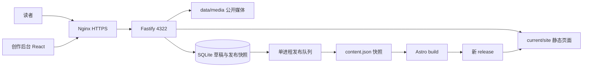

# 架构、技术栈与模块

核对日期：2026-10-02。入口：[文档索引](README.md)。

## 技术栈

下表是 `package.json` 声明范围，精确安装版本由 `package-lock.json` 锁定。升级使用锁文件和验证结果，不凭本文中的范围替换依赖。

| 层 | 技术 | 用途 |
| --- | --- | --- |
| 运行时 | Node.js >=24.8，ESM | 原生 `node:sqlite`、HTTP 服务和运行时静态构建 |
| 前台 | Astro ^7.3.5 | `output: static`，完整 HTML、SEO、RSS、搜索索引 |
| 后台 | React / ReactDOM ^19.1.1，Vite ^6.3.6 | `/admin/` 创作管理 SPA，lucide-react 图标 |
| 服务 | Fastify ^5.6.0 | Cookie、多文件上传、局部限流、静态文件分发 |
| 数据 | SQLite，WAL、外键 | 文章、版本、设置、评论、会话、发布任务 |
| 校验 | Zod ^4.1.0 | API 输入约束 |
| 排版 | markdown-it ^14.1.0 + anchor / footnote / task-lists / texmath | 标题锚点、脚注、任务列表、公式 |
| 公式与代码 | KaTeX ^0.16.22，Shiki ^3.12.0 | 数学排版、代码高亮和复制 |
| 内容安全 | sanitize-html ^2.17.0 | Markdown 和历史 HTML 的统一清洗 |
| 导入与归档 | gray-matter ^4.0.3，JSZip ^3.10.1 | Front Matter、MD/ZIP 导入、备份导出 |
| 类型检查 | TypeScript ^5.9.2 | `tsc --noEmit`；`allowJs=true`、`checkJs=false`，不代表后端 JS 已完整类型检查 |
| 部署 | Docker Compose，node:24-bookworm-slim，Nginx 1.18 | Linux x64/ARM；TLS、反向代理 |

## 访问与发布链路

读者页面由预生成 HTML 提供，搜索在浏览器读取静态索引；评论、访问量、喜欢调用 API。管理员登录后编辑数据库草稿，显式发布时构建新目录并切换 `data/current`。详见 [发布一致性与失败边界](DATA-MODEL.md)。

## 实现路线与保留原则

已完成的路线是：解析 Halo 备份和历史增量快照 → 将文章、页面、版本、评论、分类及媒体写入自有模型 → 保留固定链接与视觉资产，构建响应式 Astro 页面 → 实现 React 创作后台和 Fastify API → 加入版本化静态发布、备份验证、缓存响应头；实际迁移验收与部署记录仅在私有环境保存。

迁移不依赖运行中的 Halo。原始来源元数据留在数据库用于追溯，公开导出会去掉文章 `source`。历史内容不是重写生成的文章。缺失原件必须按迁移报告记录，不能宣称已恢复。

## 文件与职责

| 文件 / 目录 | 职责与联动 |
| --- | --- |
| `src/layouts/Site.astro` | 共同页面外壳、SEO、左右栏、导航、搜索弹层、主题初始化、可选统计脚本 |
| `src/components/PostCard.astro`、`Listing.astro`、`Icon.astro` | 列表卡片、分页与统一 SVG 图标 |
| `src/styles/site.css` | 前台主题变量、透明卡片、正文排版、断点和动效降级 |
| `src/scripts/site.ts` | 主题、移动菜单、搜索、代码复制、图片放大、目录高亮、评论与计数 |
| `src/lib/content.mjs` | 构建快照读取、公开文章排序、摘要、正文转换、友链特殊渲染与资源映射 |
| `src/pages/` | 静态路由和索引，见下表 |
| `admin/src/main.tsx` | API 客户端和后台状态；App、Login、Editor、JobRows、Media、Comments、Taxonomy、SiteSettings、Account |
| `admin/src/style.css` | 后台桌面侧栏、移动抽屉、表单与编辑器布局 |
| `admin/vite.config.ts` | `/admin/` 基路径、开发代理、`dist/admin` 输出 |
| `server/index.mjs` | API 注册、Zod schema、鉴权接入、响应头、静态分发与错误处理 |
| `server/db.mjs` | 建表、默认设置、草稿与版本读写、公开内容导出、路径验证 |
| `server/auth.mjs` | scrypt 密码哈希、会话创建、Token 哈希与有效期 |
| `server/markdown.mjs` | 统一 Markdown/HTML 清洗、代码与公式、Front Matter 解析 |
| `server/uploads.mjs` | 上传限额、ZIP 路径检查、媒体保存、相对资源引用改写 |
| `server/publish.mjs` | 构建队列、快照、release、发布状态、旧链接页、可选 CDN 清除 |
| `server/backup.mjs` | 数据库在线备份、媒体和清单打 ZIP |
| `scripts/import-halo.mjs` | 一次性 Halo 导入，拒绝已有文章数据库 |
| `scripts/recover-assets.mjs`、`archive-external-images.mjs` | 迁移资源补全，使用前逐项阅读，不能当日常更新脚本 |
| `scripts/initialize.mjs`、`create-admin.mjs` | 容器初始化、首次管理员和首次站点构建 |
| `scripts/backup.mjs`、`verify-backup.mjs` | 备份命令及恢复完整性验证 |
| `tests/core.test.mjs` | 隔离数据库中的核心回归 |
| `scripts/verify-workflow.mjs`、`verify-preview.mjs` | 迁移阶段流程与服务验收，使用限制见运维文档 |
| `Dockerfile`、`compose.yaml`、`deploy/nginx-oracle.conf` | 正式部署入口 |

## 前台路由

| 路由 | 源码 | 行为 |
| --- | --- | --- |
| `/` | `src/pages/index.astro` | 首页，置顶优先、发布时间倒序，每页 10 篇 |
| 文章/页面的 `path` | `src/pages/[...route].astro` | 正文、目录、元信息；文章有上一篇/下一篇 |
| `/categories/:slug`、`/tags/:slug` | 同上 | 以配置名称匹配文章分类标签 |
| `/page/:n`、`/index/page/:n` | 同上 | 两组分页路径兼容 |
| `/archives`、`/categories` | 对应 `.astro` 页面 | 年月归档、分类入口 |
| `/search-index.json` | `search-index.json.ts` | 仅公开文章，字段 title/path/excerpt/text；客户端最多显示 30 项 |
| `/rss.xml`、`/sitemap.xml` | 对应 `.ts` 文件 | RSS 为文章摘要；sitemap 含公开内容与分类标签入口 |
| `/404` | `404.astro` | Fastify 未找到文件时返回此产物并设置 404 |
| `/you-lian` | 通用内容页 + `bodyOf` | 特殊生成友链表；不能仅改正文期待替换友链设置 |

## 视觉与响应式契约

默认最大内容宽度 1536px，桌面为左资料栏、中间正文、右公告/目录三栏；左右各 22%，中间自适应。背景图片、WenCang 字体和半透明卡片要作为整体维护。明暗主题使用 CSS 变量与 `data-theme`，用户选择保存在 localStorage。

| 宽度 | 前台布局 | 后台布局 |
| --- | --- | --- |
| >=1200px | 完整三栏，侧栏 sticky | 固定侧栏 + 工作区 |
| 768–1199px | 左栏 250px + 正文，隐藏右栏；文章内折叠目录 | 缩窄侧栏与工作区 |
| <=767px | 单栏，隐藏两侧栏，抽屉导航与文章内目录，评论表单单列 | 抽屉侧栏、适配手机的表单与工具栏 |
| >=1600px / 后台 >=1700px | 调整外边距 | 调整工作区留白 |

验收不能只测一个浏览器窗口。至少验证 360、390、767、768、1199、1200、1440、1920px 的首页、长文章、搜索和后台编辑器；长代码/表格/公式在组件内滚动，页面不应整体横向溢出。检查键盘焦点、图片放大、目录和 `prefers-reduced-motion`。

## 后续可选改进（未实现）

版本化数据库迁移；后台组件拆分与类型收紧；更完整 ZIP 引用改写与批量导入事务；发布崩溃恢复日志和共享队列；媒体 MIME 检查与私有媒体权限；release/备份保留策略与异地定时备份；结构化 OpenAPI 与自动契约校验。按真实需求实施，不把这些写成当前能力。
